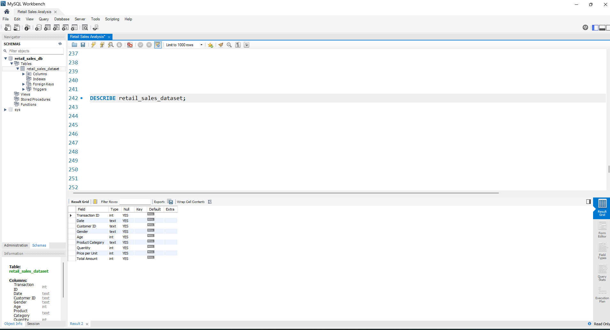
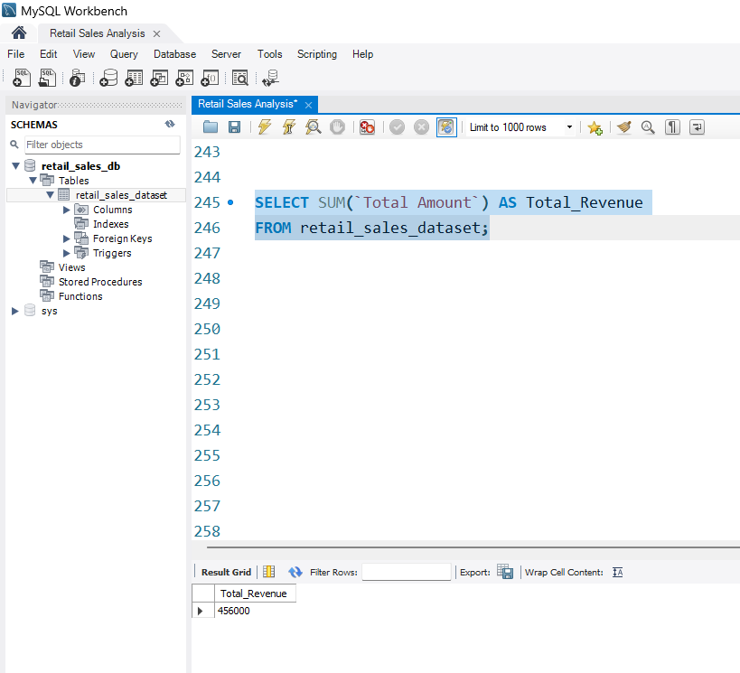
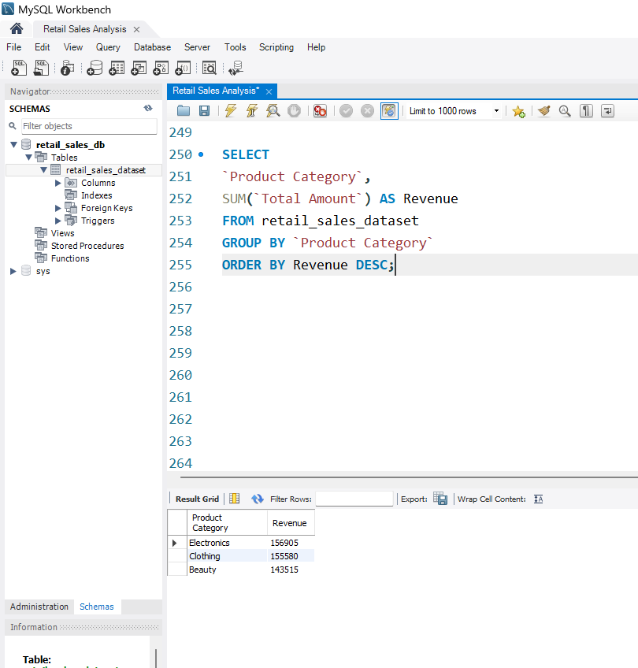
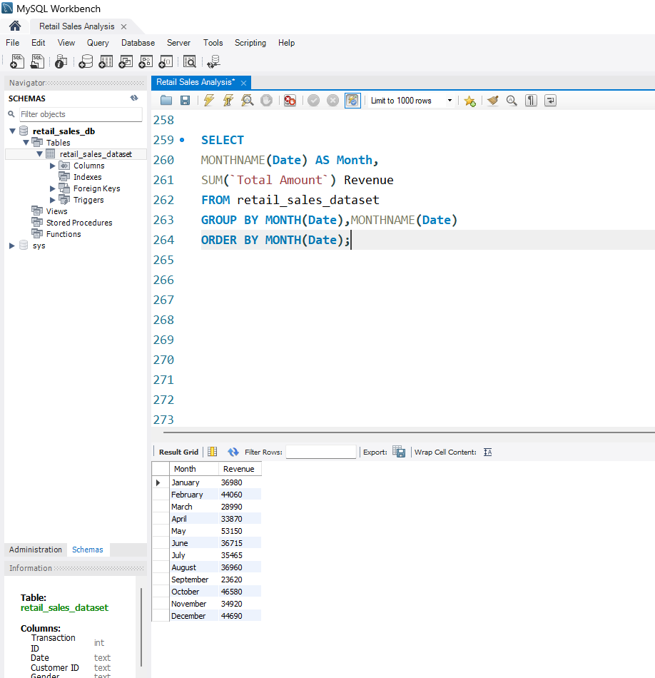
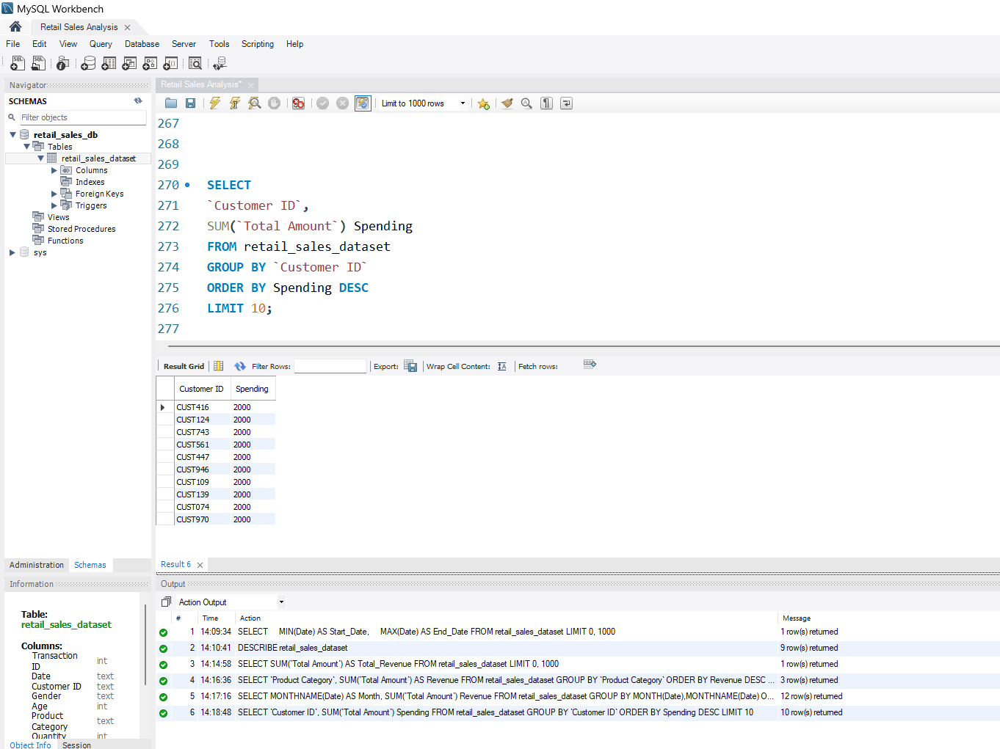
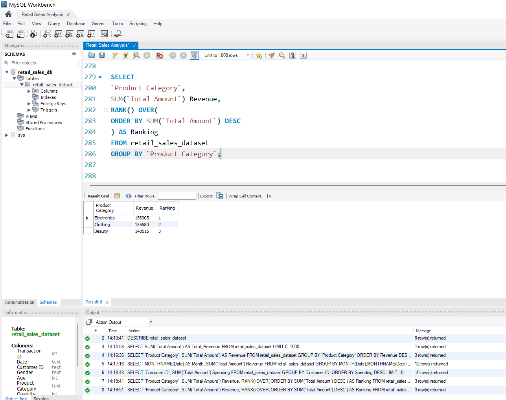

# 🛒 Retail Sales Analysis Using MySQL

> **End-to-End SQL Portfolio Project | Junior Data Analyst Portfolio**


---

# 📌 Project Overview

This project analyzes a retail sales dataset using **MySQL** to extract meaningful business insights. It demonstrates practical SQL skills required for a **Junior Data Analyst** role, including data quality assessment, exploratory data analysis, sales analysis, customer behavior analysis, and advanced SQL techniques.

The project follows a real-world analytical workflow—from importing the dataset to generating business insights.

---

# 🎯 Business Problem

Retail businesses collect thousands of transactions every day, but raw data alone cannot support business decisions.

This project answers important business questions such as:

- Which product category generates the highest revenue?
- Which customers contribute the most sales?
- What are the monthly sales trends?
- Which customer segment spends the most?
- How does customer purchasing behavior vary?

The insights can help businesses improve inventory management, marketing strategies, and customer retention.

---

# 🛠️ Tech Stack

| Tool | Purpose |
|------|---------|
| MySQL | Data Analysis |
| MySQL Workbench | SQL Development |
| Git | Version Control |
| GitHub | Project Hosting |

---

# 📂 Dataset Information

**Database**

```text
retail_sales_db
```

**Table**

```text
retail_sales_dataset
```

### Dataset Columns

| Column |
|---------|
| Transaction ID |
| Date |
| Customer ID |
| Gender |
| Age |
| Product Category |
| Quantity |
| Price per Unit |
| Total Amount |

---

# 📁 Repository Structure

| Folder / File | Description |
|---------------|-------------|
| 📂 [dataset](./dataset/) | Retail Sales Dataset (CSV) |
| 📂 [sql](./sql/) | Complete SQL Scripts |
| 📂 [screenshots](./screenshots/) | SQL Query Results |
| 📂 [presentation](./presentation/) | Interview Presentation |
| 📂 [docs](./docs/) | Project Documentation |
| 📄 [README.md](./README.md) | Project Overview |
| 📄 [LICENSE](./LICENSE) | MIT License |

---

# 📊 Project Workflow

```text
Retail Sales CSV
        │
        ▼
Import into MySQL
        │
        ▼
Database Verification
        │
        ▼
Data Quality Check
        │
        ▼
Exploratory Data Analysis
        │
        ▼
Sales Analysis
        │
        ▼
Customer Analysis
        │
        ▼
Advanced SQL
        │
        ▼
Business Insights
```

---

# 📂 SQL Scripts

| File | Description |
|------|-------------|
| [01_database_setup.sql](./sql/01_database_setup.sql) | Database verification and dataset preview |
| [02_data_quality_check.sql](./sql/02_data_quality_check.sql) | Missing values, duplicates, invalid data checks |
| [03_exploratory_data_analysis.sql](./sql/03_exploratory_data_analysis.sql) | Dataset exploration and summary statistics |
| [04_sales_analysis.sql](./sql/04_sales_analysis.sql) | Revenue, sales trends, and product analysis |
| [05_customer_analysis.sql](./sql/05_customer_analysis.sql) | Customer demographics and spending behavior |
| [06_advanced_sql.sql](./sql/06_advanced_sql.sql) | Window functions, ranking, and advanced analysis |

---

# 💻 SQL Skills Demonstrated

### Basic SQL

- SELECT
- WHERE
- ORDER BY
- LIMIT
- DISTINCT

### Aggregate Functions

- COUNT()
- SUM()
- AVG()
- MAX()
- MIN()

### Grouping

- GROUP BY
- HAVING

### Conditional Logic

- CASE

### Date Functions

- MONTH()
- MONTHNAME()
- DAYOFWEEK()

### Advanced SQL

- Subqueries
- Window Functions
- RANK()
- DENSE_RANK()
- ROW_NUMBER()
- PARTITION BY
- Running Total

---

# 📈 Business Questions Solved

✔ What is the total revenue?

✔ Which product category generated the highest revenue?

✔ Which category sold the highest quantity?

✔ What is the average order value?

✔ Who are the top spending customers?

✔ What is the average customer spending?

✔ Which gender contributes the highest revenue?

✔ Which age group purchases the most?

✔ What are the monthly sales trends?

✔ How do weekend sales compare to weekday sales?

✔ What percentage of total revenue comes from each product category?

---

# 📷 Project Screenshots

## Database Structure



---

## Total Revenue



---

## Revenue by Product Category



---

## Monthly Sales Trend



---

## Customer Analysis



---

## Advanced SQL (Window Functions)



---

# 💡 Key Insights

- Electronics generated the highest revenue among all product categories.
- Monthly sales trends revealed periods of peak business performance.
- A small group of customers contributed a significant share of total revenue.
- Customer purchasing behavior varied across different age groups.
- Weekend sales showed different purchasing patterns compared to weekdays.

> **Note:** Replace these insights with the actual findings from your dataset after running the queries.

---

# 🚀 Future Improvements

- Normalize the database into multiple related tables
- Perform JOIN-based analysis
- Create SQL Views
- Implement Stored Procedures
- Optimize queries using Indexes
- Build an interactive Power BI Dashboard
- Create KPI dashboards for executives

---

# 📚 What I Learned

Through this project, I gained hands-on experience in:

- Importing CSV datasets into MySQL
- Performing data quality assessments
- Writing analytical SQL queries
- Solving business problems using SQL
- Applying Window Functions
- Organizing projects using Git and GitHub
- Presenting insights in a structured format

---

# 👨‍💻 About This Project

This project was developed as part of my Data Analyst portfolio to demonstrate SQL proficiency in solving real-world business problems. The focus was on converting raw transactional data into actionable business insights through structured analysis.

---

# 🤝 Connect With Me

**GitHub**
https://github.com/Shub-afk

**LinkedIn**

www.linkedin.com/in/shubham-negi-5184b7327


---

## ⭐ If you found this project helpful, consider giving it a star!

Thank you for visiting this repository!
